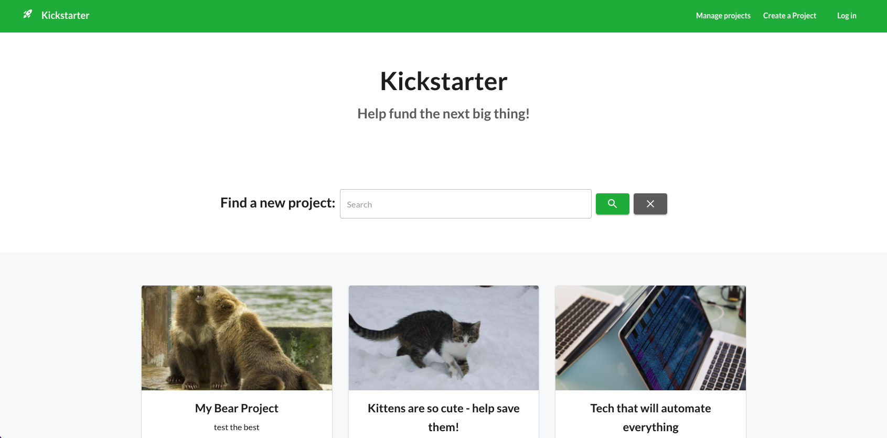
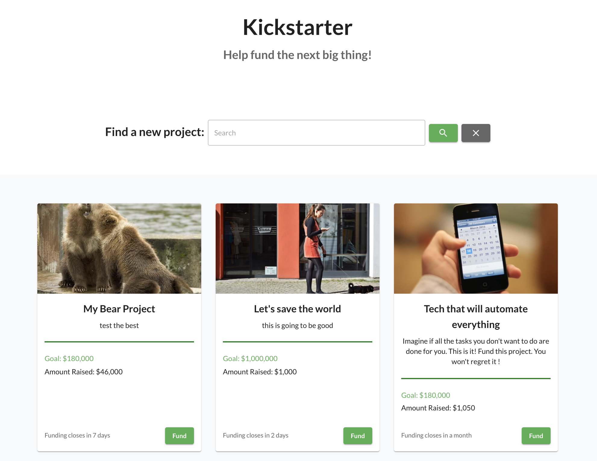
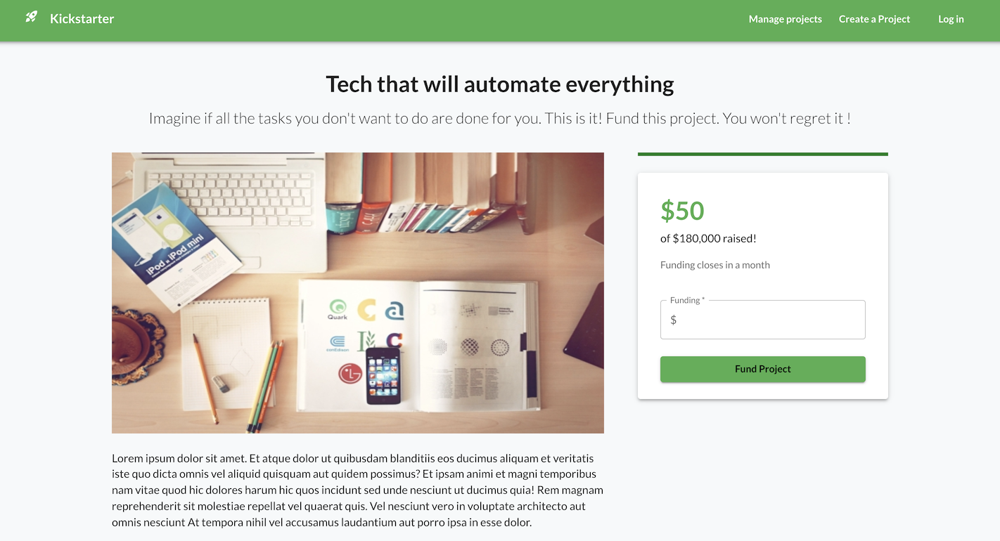
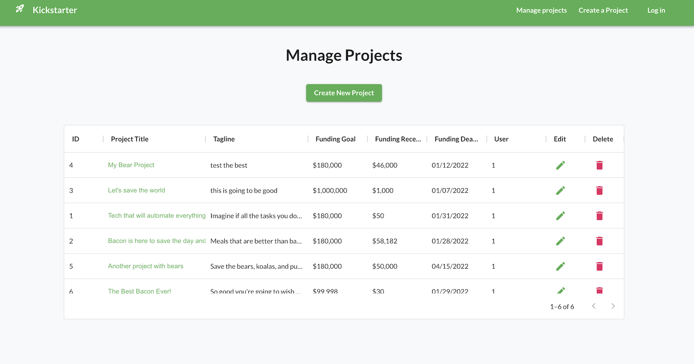

<!-- PROJECT LOGO -->
<br />
<div align="center">
  <a href="https://github.com/chiakat/kickstarter-clone">
    
  </a>
</div>

# Kickstarter App

**Created By:**
<a href="https://github.com/chiakat">Katherine Yu</a>


<!-- ABOUT THE PROJECT -->
## About The Project

<div align="center">
  
</div>

This project is a kickstarter app that allows entrepreneurs to post product ideas to contribute to intial seed funding. It utilizes the Stripe API to process payments from users.

<p align="right">(<a href="#top">back to top</a>)</p>

## App Features

<table>
  <tr>
    <td>
      
    </td>
    <td>
      <b>Home / Project Feed:</b> On the home page, users can browse and search through various projects that have been created. They can click on the Fund button to view more details about the project.
    </td>
  </tr>
  <tr>
    <td>
      
    </td>
    <td>
      <b>Create / Update Project:</b> Users can create new projects and update existing projects through this form. If accessed via the "Create a project" link, the form will start blank. If accessed via the "Edit" option, the form will be prepopulated with the details of the existing project. The data is stored in a PostGres database and changes will be reflected immediately on the home feed.
    </td>
  </tr>
  <tr>
    <td>
      
    </td>
    <td>
      <b>Project Details:</b>  Users can find additional detail about the project on the project's specific page. Here is where users can enter the amount they would like to contribute to the project.
    </td>
  </tr>
  <tr>
    <td>
      
    </td>
    <td>
      <b>Funding:</b> The Stripe API powers the funding mechanism. Clicking the Fund button will redirect users to the Stripe checkout page where they enter payment details and submit. If the submission is successful, users will be redirected to a "Success" page. If the user cancels, the user will be redirected to the home page. Funding added will be saved to the total in the PostGres Database and reflected on site when the page refreshes.
    </td>
  </tr>
  <tr>
    <td>
      
    </td>
    <td>
      <b>Manage Projects:</b> A user can view all their projects and edit or delete them from this table. Clicking create a project will redirect them to the new project form.
    </td>
  </tr>
</table>

<p align="right">(<a href="#top">back to top</a>)</p>

### Built With

* [TypeScript](https://www.typescriptlang.org/)
* [React.js](https://reactjs.org/)
* [Express.js](https://expressjs.com/)
* [MUI](https://mui.com/)
* [PostgreSQL](https://www.postgresql.org/)

<p align="right">(<a href="#top">back to top</a>)</p>

### Getting Started (run locally)

### Start Back-End Server
Navigate to server folder
```bash
cd server
```

Install dependencies:

```bash
npm install
```

Run and start the server:

```bash
npm start
```

### Start Front-End Client
Navigate to client folder
```bash
cd client
```

Install dependencies:

```bash
npm install
```

Run and start the development server:

```bash
npm start
```

Open [http://localhost:3000](http://localhost:3000) with your browser to see the result.


### Public View
Open [https://54.153.4.227](https://54.153.4.227) with your browser to see the site.

<p align="right">(<a href="#top">back to top</a>)</p>
